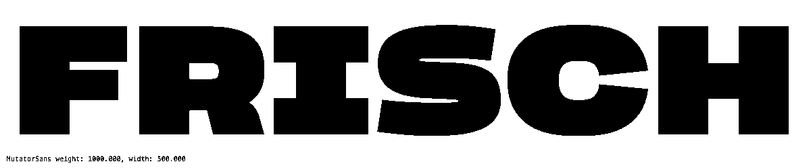

# MutatorSans

This project consists of [UFO](http://unifiedfontobject.org) source font data for a small 2 dimensional [designspace](https://fonttools.readthedocs.io/en/latest/designspaceLib/python.html).

* Weight and width axes, some glyphs have intermediates.
* Intended for testing all sorts of [variable and mutator math](https://github.com/LettError/MutatorMath) and making it not look entirely stupid.
* Contains components.
* [Rule](https://github.com/fonttools/fonttools/tree/master/Doc/source/designspaceLib#rules) with conditionset that switches serifs on the `I` and the terminals of the `S`.
* Cubic outlines.
* Working minimal Variable Font, however without STAT table, or complete characterset, lowercase or numerals.
* Drawbot script with sample animation based [here](https://github.com/LettError/mutatorSans/tree/master/drawbot).
* I may or may not add to the characterset. Probably not. 

## Building in RoboFont
* Install the [Batch RoboFont extension](https://github.com/typemytype/batchRoboFontExtension)
* Open the designspace file with Batch using the Open menu, or drag a designspace file into the list.
* Find the **Variable Fonts** tab and click **generate**.

## Specimen
Axis-Praxis has a [MutatorSans specimen](http://www.axis-praxis.org/specimens/mutatorsans) that you can play with.

## Disclaimer
As it is a typographic lab rat this font might contain data that is not appropriate for release. The name *MutatorSans* has not been checked for copyrights. The outlines are definitely drawn by me.

## License
* MIT
